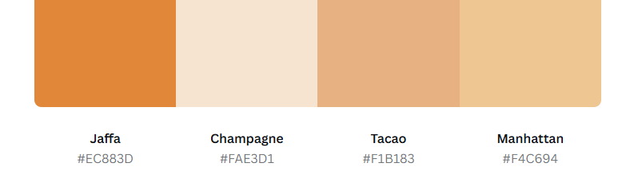
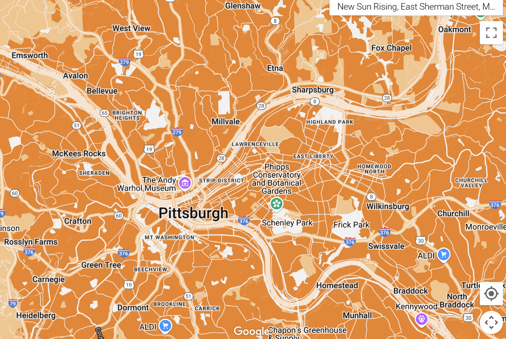
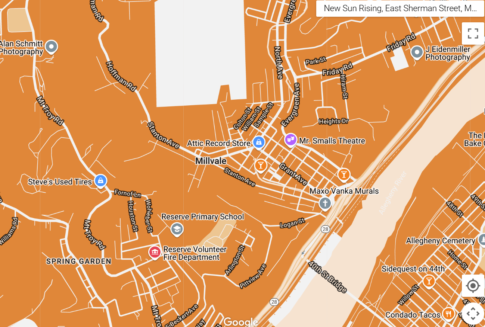
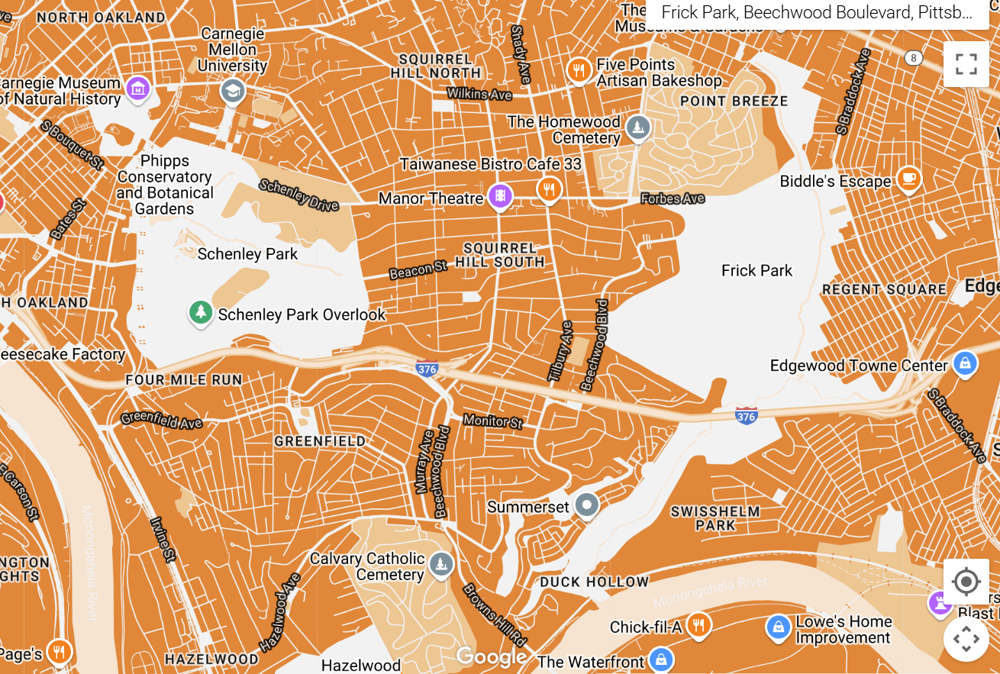

# Building a map for a non-profit organization

I created a custom Google Map for New Sun Rising (NSR), an intermediary non-profit in Millvale, Pennsylvania. I actually work for NSR now, but since they have maps already, I created this for fun. 

I used [Canva's Color Generator](https://www.canva.com/colors/color-palette-generator/) to create a color paltette for the map I wanted to create. Here is the color palette that I used to create this map:

Here is the map that I created using the color palette above: 

# 1 - Zoomed out view of Pittsburgh

# 2 - Zoomed in view of Millvale, Pennsylvania (Location of New Sun Rising)

# 3 - View of Frick and Schenley Park in Pittsburgh

